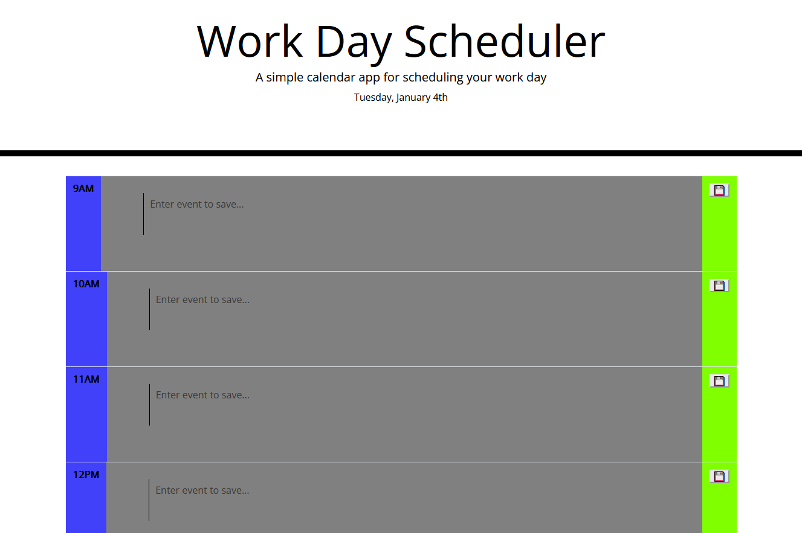

# Work Day Scheduler

  ## Description
  
A simple day-planner application that allows the user to save an event each hour. Visual cues help the user know which events have passed and which are upcoming.
  
  ## Table of Contents
  
  - [Usage](#usage)
  - [License](#license)
  - [Contributing](#contributing)
  - [Questions](#questions)
  

  ## Usage
  
Visit the application live site.

[Youtube Video of Application in Action](https://youtu.be/L1EJCYBBJR0)

  ## License

[Coffeeware](https://github.com/Sonic853/coffeeware-license)
     License

        

  
  #### Github
  
  https://github.com/T0mWhite
  

  
  
  

